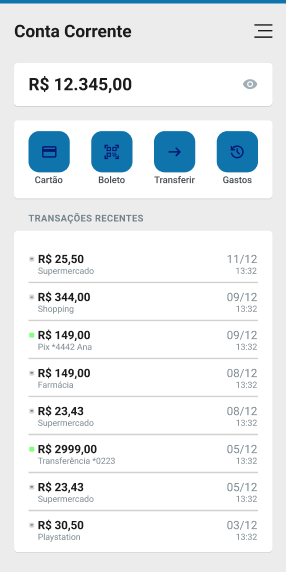
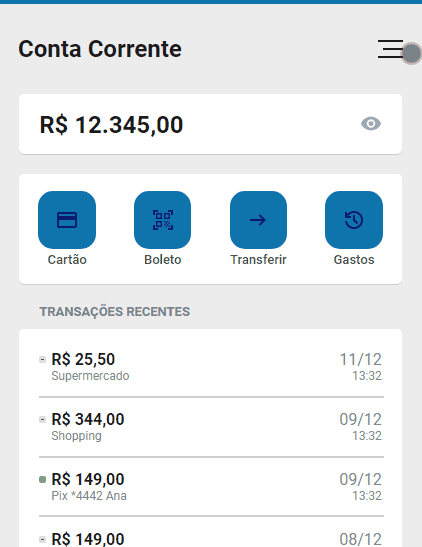

# Projeto Conta Corrente

Comecei a estudar UI/UX design a algum tempo e fiz um pequeno layout de uma conta corrente no formato de um celular, portanto invés de deixar apenas o layout, decidi me desafiar a tentar replicar como se fosse um site mesmo e vou apresentar o resultado.

## Índice

-  [Visão Geral](#visão-geral)
   -  [Screenshots](#screenshots)
      -  [Layout](#layout)
      -  [Site](#site)
   -  [Link](#link)
-  [Meu Processo](#meu-processo)
   -  [Tecnologias/Programas Utilizados](#tecnologias/programas-utilizados)
-  [Conclusão](#conclusão)
-  
## Visão Geral

Meu objetivo nesse desafio que eu me propus a fazer, era basicamente, testar meus conhecimentos em HTML e CSS totalmente do 0, sem ver qualquer tipo de ajuda ou tutorial na internet, transformando assim, o layout da conta corrente em uma página web.

OBS: Recomendo abrir o site pelo celular para ter a melhor versão do mesmo.

### Screenshots

#### Layout

#### Site

### Link

- Site da Conta Corrente: [Conta Corrente](https://msumii.github.io/projeto-conta-corrente/)

## Meu Processo
Foi um desafio fazer sem recorrer aos sites da internet, apenas botei em prática o que eu sabia e tentar deixar o código o mais semântico e o mais simples possível.

### Tecnologias/Programas Utilizados

- HTML
- CSS
- Git
- VSCode
- Figma

## Conclusão

Como eu disse, foi algo bem desafiador, pois como apenas estou iniciando na área, certas coisas tive bastante de dificuldade principalmente para organizar os elementos. Portanto, mantive a calma e fiz uma coisa de cada vez, completando meu primeiro desafio e fazendo um site totalmente do 0 sem nenhum tipo de apoio externo.